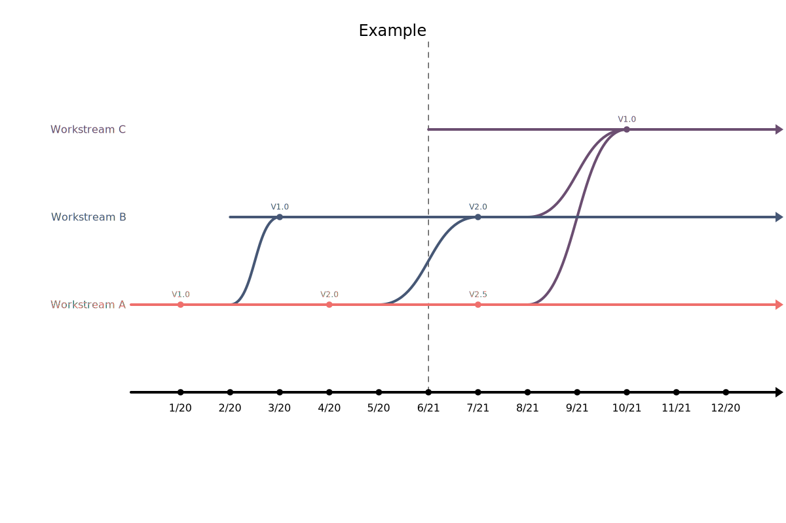

Timelines
=========

Simple way to create downloadable SVG diagrams of interdependent timelines derived from a YAML model.

Try it online: https://bernardtsai.github.io/timelines/

Features
--------

- converts yaml model into SVG
- error message
- SVG can be downloaded
- sample yaml model included
- online service via GitHub pages
- free to use for all

Example
-------

The following yaml model:

````
name:   "Example"
unit:   "month"
layout: "year"
start:  "0/20"
end:    "1/21"
today:  "6/20"
streams:
 - name: "Workstream A"
   start: "start"
   end:   "end"
   milestones:
    - version:     "V1.0"
      date:        "1/20"
      description: "First version"
    - version:     "V2.0"
      date:        "4/20"
      description: "Second version"
    - version:     "V2.5"
      date:        "7/20"
      description: "Second version 2 patch"
 - name: "Workstream B"
   start: "02/20"
   end:   "end"
   milestones:
    - version:     "V1.0"
      date:        "3/20"
      description: "First version"
      dependencies:
       - stream:   "Workstream A"
         version:  "V1.0"
         duration: 1
    - version:     "V2.0"
      date:        "7/20"
      description: "Second version"
      dependencies:
       - stream:   "Workstream A"
         version:  "V2.0"
         duration: 2
 - name: "Workstream C"
   start: "06/20"
   end:   "end"
   milestones:
    - version:     "V1.0"
      date:        "10/20"
      description: "First version"
      dependencies:
       - stream:   "Workstream A"
         version:  "V1.0"
         duration: 2
       - stream:   "Workstream B"
         version:  "V2.0"
         duration: 2
````


will generate following diagram:




Dependencies
------------

- js-yaml
- compressed version of Roboto webfonts


---

**Author:** bernard@tsai.eu  
**Date:**   2020-06-08  
